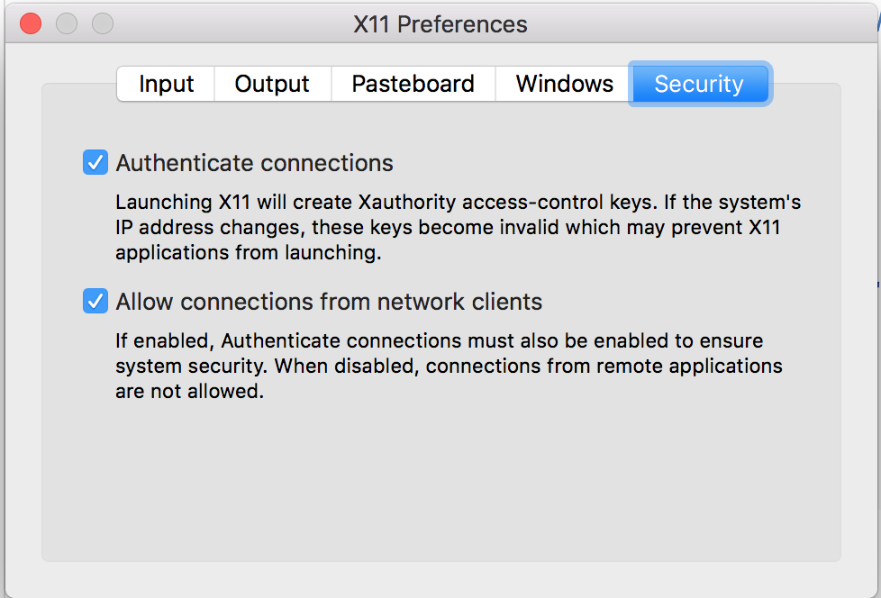

# docker-for-mlstudy

It's a Dockerfile setting up dev environment for Dataparty(https://github.com/j6lim/dataparty) experiments. 

## On Mac OS X
When you run Docker on Mac using Docker for Mac(https://docs.docker.com/engine/installation/mac/), it's a little tricky to use Matplotlib.

```bash
$ brew cask install xquartz
$ open -a XQuartz

# from terminal of XQuartz
xquartz $ ip=$(ifconfig en0 | grep inet | awk '$1=="inet" {print $2}')
xquartz $ xhost + ip
# Keep it running while working.
```
Click all checkboxes from preference.


```bash
# Remember to run below after you finish your works.
xquartz $ xhost - ip
```


## Running docker
```bash
$ git clone https://github.com/jooddang/docker-for-mlstudy
$ docker build -t "ml-study:0.1" .
# {IP} is your host OS X's IP address used above.
$ docker run -it --rm -v /path/to/dataparty/:/mnt -v /private/tmp/.X11-unix:/tmp/.X11-unix -e DISPLAY={IP}:0 ml-study:0.1
docker $ cd /mnt # and run the experiments.
```
